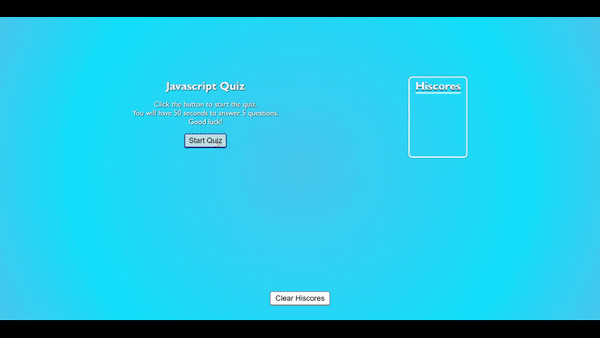

# Code Quiz
Mobile friendly!

## Table of Contents
1. [Description](#description)
2. [Visuals](#visuals)
3. [Usage](#usage)
3. [Resources](#resources)

## Description
This is a quiz to test your knowledge on JavaScript. Give it a try!

## Usage
- Click the 'Start Quiz' button
- Click on the answer you think is right to choose your answer and move to the next question
- At the end of the quiz, enter your initials and click the 'Submit' button to save your hiscore
- If you wish to clear your hiscores, press the 'Clear Hiscores' button at the bottom

## Visuals

## Resources
- [Live Site](https://jthefox.github.io/code-quiz/)
- [Online Repository](https://github.com/JtheFox/code-quiz)
- [Quiz Questions Source](https://www.tutorialspoint.com/javascript/javascript_online_quiz.htm)
